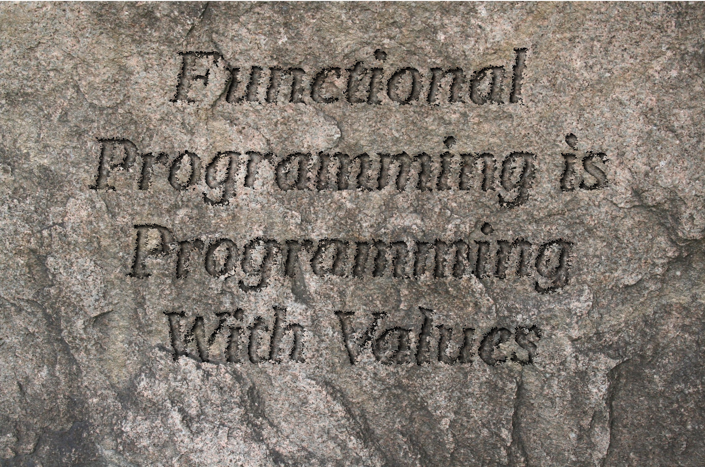
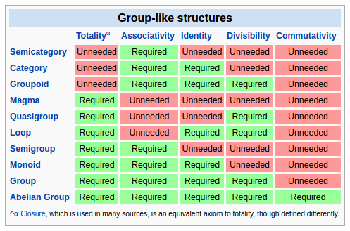

Monstrous Names Aren't Scary
============================

Kris Nuttycombe

(@nuttycom)

May 28, 2016

<aside class="notes">

One of the first things that I think that everybody notices, basically as soon
as they get started with functional programming, is that as soon as you start
looking at resources, reading blog posts, maybe trying to understand the
workings of some library related to a problem you're interested in, that 
the words you're reading have absolutely *nothing to do* with anything that
you've previously encountered in programming. Even familiar terms like "sum" 
and "product" are endowed with new and mysterious significance. It's like being 
dropped into the middle of a D&D campaign without access to the monster manual.

The truth is, your fear is justified. In one way or another, every one of those
unfamiliar words represents a concept that you need to learn in order to be
able to create working software. Now, sure, it's possible to write some simple
programs without, for example, knowing what a monad is, but the truth is that I
don't think any of us really want to just write "getting your feet wet" kinds
of programs. We know deep down that if we wan to really understand a language's
strengths and weaknesses, we'll have to do something nontrivial. And to do
something nontrivial, we'll have to admit that that there's a lot we don't
know, and that learning it will probably take a lot of effort and time. If that's
not scary, it's at least a bit daunting.

The purpose of this talk is to give you a bit of a framework for thinking about
functional programming that will hopefully make it all a bit less daunting.

</aside>

------

<aside class="notes">

What is functional programming? A lot of sources describe it in terms of
programming with pure functions that deterministically map inputs to outputs,
using only immutable data structures. A lot of attention is given to
programming with higher-order functions, which are just functions that take
other functions as arguments. However, I think this focus on functions is a
little misplaced. When I speak about functional programming, somewhat
ironically, what I'm talking about is programming with *values*. 

So what are values? First we can think of some really primitive building
blocks, from which we can build everything else - these are boolean values, or
as we frequently think of them when gathered together with some structure,
bits. For convenience, most languages give us some predefined ways in which we
can refer to larger assemblies of these things; 64-bit integers, IEEE floats,
and so forth. 

* Primitive arrangements of bits are values
* Instances of data structures are values
* Functions are values
* Programs are values
* Types are values (!)

Now, think for a moment about the value "True." While it's pretty easy to
imagine a *reference* to a boolean value like being mutable, it's pretty clear
that the value "True" itself isn't; by extension, any conceptual assembly of
true and false values is itself an immutable value. In functional programming,
we also inhibit *references* to values from changing.

So, where does this leave us? If we can't change values, and we can't change
references to values, what exactly can we do? It comes down to just a couple of
operations. First, we can, given a value, think about observe some subset of
that value, so that instead of looking at the whole we're just considering a
part.

The other thing that we can do, and the operation that is going to be the focus
of all of the rest of this talk, is that we can combine two values so that we
observe them as a new value.

So, what does this all have to do with how names in functional programming can
be unfamiliar and scary? Well, you know that apocryphal (and probably false)
story about how the Inuit have maybe fifty, or maybe a couple of hundred,
distinct words for snow? In functional programming, we have lots and lots of 
ways of combining values, and when you have so many ways of doing *essentially*
the same thing, you need a lot of names to describe the subtle differences
in these combining operations.

Before we can talk about the interesting ways in which we can combine values,
though, I want to quickly say a word about types.

</aside>

Types
=====

The purpose of a type system is to verify that we have minimized the potential
state space of an application such that only valid states are representable.

<aside class="notes">

When I talk about functional programming, I essentially always talk about
*typed* functional programming, because what I'm personally most interested
in is our ability to reason about our programs, and, more importantly, the
ways that computers can help us with our reasoning.

As programmers, we're engaged in building some of the most complex artifacts
that human beings have ever created. The number of states that even the
simplest business application can represent dwarfs that of most physical
systems. This complexity is hard for our brains to deal with, but it's the
kind of thing that computers are great at. 

A sufficiently strong type system allows us to *simplify* our applications.
Specifically, they allow us to minimize the state space, ideally to the point
where *only valid states are representable.* Now, there are obviously
situations - invalid user input, network irregularities, and so forth - where
the program will not be able to compute the *desired* result, but by idenfying
these errors *using the type system* we transform these problems from things
that can cause an unpleasant user experience to ones where we can, and indeed
are compelled to, respond gracefully. The stories you hear about programs
working properly once they typecheck are not only true, but in my experience
they understate the value. My experience is that, with an adequately described
state space, not only do programs work on the first try, they also *virtually
never break.*

I regard the compilers I work with as a brain prosthesis - they free me from
trivial details of tracking the types of values through a program and allow me
to focus on what those values represent and how they are transformed. In
programs written in dynamic languages, I can't *afford* to make use of a lot of
the useful abstractions that are available in languages with strong type
systems, simply because too much of my attention is consumed by the mental
effort of tracking how to call the APIs I depend upon.

By contrast, in a language with a strong type system, the compiler takes care
of me, making sure that I'm not wasting my time with subtly incorrect API calls
and null pointers. This frees me up to understand how the problem I'm trying
to solve relates to other similar problems. Since it's likely that someone else
has solved a similar problem before, I can use my understanding of the *type*
that I need to search for a solution. Now, the only languages that I'm aware of
that really make use of this capablity to a substantial degree are functional
languages: Haskell has Hoogle, there's an equivalent service for PureScript, and
there are at least a couple of projects that attempt to do the same for OCaml and
Scala, though at least the Scala one doesn't seem to work very well.

So, now, let's talk briefly about how we can add types together to create new
types.

</aside>

Products
========

~~~{haxe}

typedef Pair<A, B> = {
  a: A,
  b: B
};

~~~

<aside class="notes">

Now that that's out of the way, let's talk some more about combining values.
Here, we're putting a two types (which, as I said earlier, are values, but here
values in our type-level language) together to create a new type. 

This slide is really just in here to give me an opportunity for a bit of
commentary about the programming lanugage I'm using for examples in this talk.
It's called Haxe, and while I use it in my day job at the moment, I don't
really recommend it much. If you want to really learn typed functional
programming, you should pick up a copy of the new Haskell book by Chris Allen
and Julie Moronuski, or failing that you can take the road that I did and
muddle your way through using something like Scala where you can learn
functional style but still fall back on your old bad habits when you're under
deadline and have to crank out some code. Haxe isn't really a functional
programming language in any meaningful sense. However, it has a few qualities
that I think make it useful for an introductory talk.

First off, it's a language that I think just about anybody who has seen code
before can read. Function definitions look kind of like JavaScript, but with
type ascription using this colon syntax that we can see here, and type
parameterization (the real name for what heathens call "generics") that looks
like it does in Java, C# or Swift.

</aside>

---------

Sums
====

~~~{haxe}

enum Either<A, B> {
  Left(a: A);
  Right(b: B);
}

~~~

<aside class="notes">

Secondly, Haxe has syntax for sum types (actually generalized algebraic data
types) and pattern matching. 

Whoah, wait a minute, generalized algebraic data types? That's definitely a
scary term! Hopefully we'll be able to make that a little less scary as we go
along here, but for the moment I do want to speak really briefly about sum
types. Haxe calls them 'enums' which is helpfully suggestive for folks coming
from languages like C and Java. 

Unlike what's typically termed an enum, values of a sum type can carry around
additional data, which you can retrieve when you pattern match on a value of
that type. Each term of the 'enum' block is called a 'constructor' for that data
type - just to be clear, 'Just' isn't a type, it's a constructor for a value
of type 'Maybe of A'. 

Types like this, where you can have multiple different constructors for values
of the same type, are really, really important, so important that I kind of
think that languages that lack first-class support for them are really
crippled.  The reason that they're so important is that, when building an
application, it's really useful to think about the state space of the
application, and more specifically how to minimize the number of states
there are within that space. Does everybody know what I'm talking about here?

(If not, proceed down)

Finally, it *does not* have higher kinded types, which means that a whole lot
of abstractions that folks from the Haskell and Scala worlds find invaluable
are not actually representable in the language. While this is in my opinion a
terrible deficiency, for the purposes of this talk I'm going to spin it as an
advantage, because it forces me to use examples that are reproducible in
*other* languages that lack higher-kinded types, like Java and C# and Swift,
which are probably what many of you are stuck using. More importantly though, 
it means that the examples that you see will be very concrete. In functional
proramming, we love to use a lot of high-level abstractions because they let
us avoid writing a lot of boilerplate code and help us to avoid coupling,
but in my experience for learning it's necessary to progress from concrete
examples to the abstract. Here, all that you're going to see are the concrete
bits, because the language doesn't actually let me represent the abstracted
versions.

</aside>

How Many States?
----------------

~~~{haxe}
var b: Bool = /* censored */;
~~~

~~~{haxe}
var i: Int = /* censored */;
~~~

~~~{haxe}
var x: { b: Bool, i: Int } = /* censored */;
~~~

~~~{haxe}
enum Either<A, B> {
  Left(a: A);
  Right(b: B);
}

var x: Either<Bool, Int> = /* censored */;
~~~

How Many States?
----------------

~~~{haxe}

var b: Bool = /* censored */;
// 2 states

var i: Int = /* censored */;
// 2^32 states

var x: { b: Bool, i: Int } = /* censored */;
// 2 * 2^32 states

enum Either<A, B> {
  Left(a: A);
  Right(b: B);
}

var x: Either<Bool, Int> = /* censored */;
// 2 + 2^32 states

~~~

Sum Type Encodings
------------------

~~~{haxe}

typedef Either<A, B> = {
  function apply<C>(ifLeft: A -> C, ifRight: B -> C): C
}

function left<A, B>(a: A): Either<A, B> = {
  function apply<C>(ifLeft: A -> C, ifRight: B -> C): C {
    return ifLeft(a);
  }
}

function right<A, B>(a: A): Either<A, B> = {
  function apply<C>(ifLeft: A -> C, ifRight: B -> C): C {
    return ifRight(a);
  }
}

~~~

One more thing before we move on, if you're not fortunate enough to work in a 
language that has syntax for sum types, they're still not unavailable to you
so long as you have either objects or closures. 

Do all of you know how to do this encoding?

In Object-Oriented languages, this sort of encoding is commonly known as
the Visitor pattern. In the so-called "Gang of Four" Design Patterns book,
however, they talk about a crippled version of this approach, which has their
"visit" and "accept" functions returning void, which means building up
your result via mutation of some shared mutable state and is just about
the most awful and non-composable bastardization of a beautiful idea that
one could come up with. 

JSON
----

~~~{haxe}

enum JValue {
  JObject(xs: Array<JAssoc>);
  JArray(xs: Array<JValue>);
  JString(s: String);
  JNum(f: Float);
  JBool(b: Bool);
  JNull;
}

typedef JAssoc = {
  fieldName: String,
  value: JValue
}

~~~

<aside class="notes">

Here's another example of the sort of thing that sum types permit you
to do - rather than using some sort of awkward map- and object-based 
representation of a JSON value, we can encode JSON as a recursive
sum type, which we can then safely traverse, ensuring that the structure
that we are expecting is present at each step. 

Sum types are really well suited to abstract syntax trees like this. We'll
see them again and again throughout the reat of the talk, and we'll expand 
our ideas about what kinds of things can exist in an abstract syntax tree.

</aside>

Functions
=========

~~~{haxe}

var f : A -> B = ...

~~~

<aside class="notes">

There's one more way to compose a pair of types apart from products and
sums, and that's this: the type of a function from one type to another 
is itself a type. And just as we've been able to count the number of states
introduced into our program with products and sums, we can do the same thing
here.

</aside>

~~~{haxe}

enum OneOfThree = { First; Second; Third; };

var f : OneOfThree -> Bool = ...

~~~

<aside class="notes">

So, we have three possible inputs, each of which may independently produce one
of two outputs. We want to figure out the size of state space that the type of
the function can represent in our program, so we have to multiply the number of
possible outputs by itself for each case of the input, which is to say that the
number of possible inhabitants of a function type is the number of inhabitants
of the output type to the *power* of the number of inhabitants of the input
type.

Now that we've covered the three ways that we can compose a pair of types to
yield a new type, let's switch over to talking about values for a bit.

</aside>

Function Composition
====================

~~~{haxe}

function compose<A, B, C>(f: B -> C, g: A -> B): A -> C {
  return function(a: A) {
    return f(g(a))
  };
}

~~~

<aside class="notes">

Here are the first two values that we'll think about composing - both of which
are functions.

Since this is an introductory talk about functional programming, I thought it
would be remiss of me to omit a slide on function composition, first because
it's so fundamental, but secondly because we will see echoes of this simple
form of composition later when we talk about Kleisli composition and lenses. 

Now, while function composition might seem a bit trivial in a talk that's
supposedly going to be about concepts with big scary names, there's something
important that I want to observe.

A lot of resources on functional programming talk about working with pure
functions (that is, functions that always produce the same output given a
particular input) and how this precludes us from performing side effects in
function evaluation. What I'd like to point out, however, is that this
"functional purity" itself is a consequence of the fact that we're programming
with values. All of our inputs are values, which implies that ambient changing
things like the state of the world cannot be inputs, at least not unless
they're explicitly snapshotted as unchanging values. Given this, there is
simply no *opportunity* to vary the behavior of a function in such a way as to
produce two different output values given the same input - there's nothing 
to dispatch upon that might change from one evaluation of a function to 
the next. 

So functional purity is a natural outgrowth of the fact that we're programming
with values. In the context of function composition, though, the really
important thing is that this purity which we've derived means that we're able
to reason about components of our systems independently, and still have that
reasoning hold when those components are composed. In mathematics, when you
have a proof of a theorem, you're then able to use that theorem in the
derivation of more complex results without having to check whether the original
proof of the theorem still holds. 

So, now let's get on to something that actually has a bit of a monstrous name.

</aside>

Associativity
=============

~~~{haxe}

f.compose(g.compose(h)) == (f.compose(g)).compose(h)

f.compose(g)(x) = f(g(x))

f.compose(g.compose(h)(x)) 
  = f(g.compose(h)(x)) 
  = f(g(h(x))) 
  = (f.compose(g))(h(x))) 
  = (f.compose(g)).compose(h)(x)

~~~

<aside class="notes">

Okay, so associativity isn't really that monstrous. After all, most of us
encountered it in grade school when they taught us addition. However, for many
of us that may also be the last time we actually *thought* about associativity,
and yet, in terms of composing a program by combining values, it's a vitally
important property.

If we're attempting to build up a system by the composition of values,
we can't have the behavior changing depending upon what order we've put
together the parts of our system in. Associativity of important binary
operations like function composition allow us to decompose our system 
freely - we can choose to factor out either the 'g.compose(h)' or
the 'f.compose(g)' in the above example without changing the meaning
of our program. We're free to let the *human* concerns of what pieces
of functionality "make sense" together guide our design.

</aside>

> Programs must be written for people to read, and only incidentally for machines to execute.
> - Abelson, Structure and Interpretation of Computer Programs.

<aside class="notes">

This is a quote from Harold Abelson in one of the bibles of our profession.
Associativity gives us the freedom we need to be able to rearrange programs
with confidence, relying upon the types of our functions to guide us. We'll
see the importance of associativity over and over again as we explore more
monstrous names in functional programming.

</aside>

Semigroup
=========

* An associative binary operation that combines two values of a type
  to yield a new value of that type.

~~~{haxe}

typedef Semigroup<A> = {
  append: A -> A -> A
}

s.append(s.append(a0, a1), a2) == s.append(a0, s.append(a1, a2))

~~~

<aside class="notes">

If we're going to be combining values, this seems about as primitive
a mechanism for combining values as one could come up with. 

So why is associativity important? 

* It allows us to reorder operations and achieve the same result,
  so long as the order of the operands is preserved.

* A coworker stated this as "You want associativity when you want to muck 
  about with evaluation order."

If functional programming is about combining values, and if we want to be able
to decompose our programs into smaller constituents, then we may want to break
up *where* we're doing that combining, or not do it all at once, and yet still
have the same meaning to our program when we put those constituents back
together.

</aside>

------

~~~{haxe}

function fold1Nel<A>(xs: NonEmptyList<A>, s: Semigroup<A>): A { 
  return switch xs {
    case Single(a): a;
    case Cons(a, ax): s.append(a, fold1Nel(ax));
  };
}

~~~

<aside class="notes">

So, what's a semigroup good for? Here's the simplest application: 

So, why don't we just call this an "AssocAppender" or something? Well, we could.
However, here's a chart that I grabbed off of Wikipedia:

</aside>

------

<aside class="notes">

We don't call this an AssocAppender because to do so would rob us of centuries
worth of literature and learning about how we can use associative binary 
operations that put together two members of a set and return another member
of that same set. Calling it a Semigroup helps us identify that this operation
is part of a larger framework of binary operations on sets, some of which may be 
useful to us in similar situations. When we look here and see that 'Monoid' is just a semigroup with 
an identity element. 

</aside>

Kleisli
-------

* (>=>) :: Monad m => (a -> m b) -> (b -> m c) -> a -> m c

Lens
----

